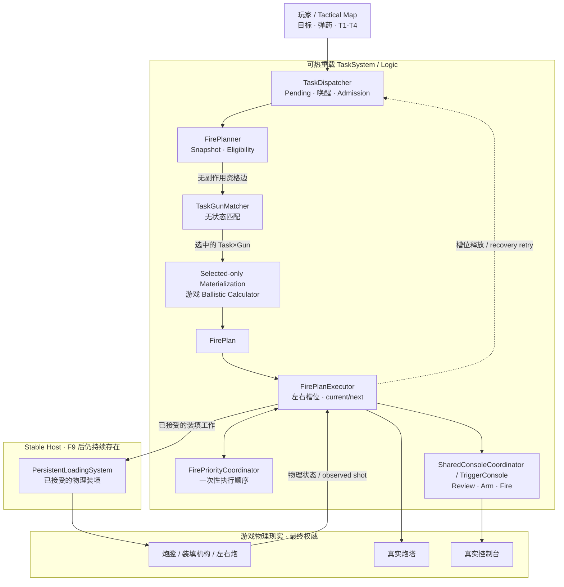
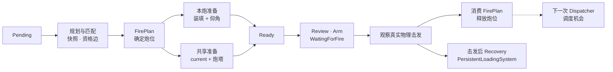
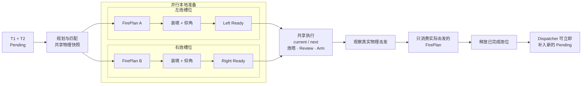

# IronNestFCS Smart

[English](README.md) | **简体中文**

这是一个面向 **Iron Nest: Heavy Turret Simulator** 的智能自动火控 Mod。

你负责在 Tactical Map 上放置目标、选择弹种和提交任务，IronNestFCS Smart 负责执行大部分重复火控流程：弹道解算、左右炮分配、弹药购买与装填、仰角、炮塔方位、Review / Arm，以及可选的自动击发。

[Nexus Mods](https://www.nexusmods.com/ironnest/mods/32) · [GitHub Release](https://github.com/HisenWeb/IronNestFCS-Smart/releases/latest) · [IRON NEST Steam 页面](https://store.steampowered.com/app/4300500/) · [MelonLoader](https://melonwiki.xyz/)

## 设计理念

**自动化操作，不自动化战术。**

你决定目标、弹药和任务顺序，Smart 负责执行计划。

需要放弃当前计划时按 **F9**。F9 重置的是 TaskSystem 的任务计划和执行状态，不会假装已经被实际装填系统接受的动作从未发生。重新提交任务后，Smart 会从两门炮此刻真实存在的物理状态继续规划。

## 主要功能

- T1～T4 可以形成任务队列，并让左右两门炮持续处理任务。
- 当前实装弹种 / 装药无法匹配的任务会继续保留在 Pending，不再直接消失；后面能够匹配的任务仍然可以继续规划。
- 按 **F9** 可以重新规划，不会抹掉已经开始的实际装填。
- 尽量读取真实炮膛、装填机构、炮塔和控制器状态后再决定下一步。
- 通过游戏自己的弹道计算器取得射击解算结果。
- 在进入较慢的游戏弹道计算器 UI 之前，会先快速排除明显的弹种不匹配或固定装药射程不足。
- 缺少炮弹或药包时可以自动购买。
- 自动调整仰角和炮塔方位。
- **Auto Fire** 可自动完成最终击发。
- **Max Charge** 可优先使用可用的最高装药量。
- 左上角 FCS 面板会显示当前任务、进度、距离、装药、仰角，以及**预计炮弹飞行时间**；飞行时间会在 FirePlan 创建后立即可用，不再等待机械 TTI 表盘进入射击准备阶段。
- Pending 任务在有必要时会显示“弹种不匹配”或“装药射程不足”等简短提示。
- 自动识别中文，支持简体中文 / English 双语 UI。
- 所有玩家共用一个通用发布包。

## 下载与安装

下载最新版通用安装包：

```text
IronNestFCS-Smart_vX.X.X.zip
```

安装步骤：

1. 使用 MelonLoader 官方安装器安装适用于 IL2CPP 的 MelonLoader，并至少正常启动一次游戏。
2. 不支持 BepInEx-to-MelonLoader bridge 安装方式；bridge 与运行时版本不兼容时，可能导致 IronNestFCS 无法正常加载。
3. 退出游戏。
4. 将 ZIP 中的全部内容直接解压到游戏根目录。
5. Windows 提示合并 `Mods`、`UserLibs`、`UserData` 时允许合并。
6. 通过 MelonLoader 正常启动游戏。

安装后应存在：

```text
<GameDir>/Mods/IronNestFCS.dll
<GameDir>/UserLibs/IronNestFCS.Abstractions.dll
<GameDir>/UserData/IronNestFCS/IronNestFCS.Logic.dll
```

不要把整个 ZIP 直接放进 `Mods` 文件夹。

## UI 自动语言识别

Smart 可自动识别中文，并支持**简体中文 / English** 双语 UI。

## 游戏内使用方法

### 1. 放置目标标记

在 Tactical Map 上拖动左侧红色数字标记器 `1～4` 到你要攻击的位置。


### 2. 选择弹种并提交任务

选择弹种，然后点击与红色标记器编号对应的 T1～T4：


```text
红色 1 → T1
红色 2 → T2
红色 3 → T3
红色 4 → T4
```

可以连续提交多个任务，Smart 会根据两门炮当前状态进行分配和执行。

如果某个任务无法匹配两门炮当前真实存在的弹药状态，它会继续留在等待队列里。这个暂时无法执行的任务不会挡住后面能够匹配当前炮况的任务。需要放弃当前等待任务并重新规划时按 **F9**。

### 3. 让 FCS 执行准备流程

一次正常任务大致会经过：

```text
读取目标
→ 读取当前真实物理状态
→ 建立 Task × Gun 资格边
→ 在两门炮之间完成任务匹配
→ 只对选中的分配进行弹道解算实体化
→ 必要时购买弹药
→ 装弹 + 装药
→ 调整仰角
→ 旋转炮塔
→ 准备 Review / Arm
→ 手动击发或 Auto Fire
```

### 4. 查看左上角状态面板

`IronNest 火控系统` 面板会显示：

- 左炮 / 右炮当前物理状态或正在执行的 T 任务；
- 任务进度与已用时间；
- 方位与距离；
- 装药与仰角；
- FirePlan 创建后即可显示的**预计炮弹飞行时间**；
- 射击顺序 / 优先级状态；
- Auto Fire 与 Max Charge 状态；
- 等待队列，以及有必要时显示的简短不匹配提示；
- 本轮成功 / 失败统计和近期任务记录。

预计飞行时间使用游戏内实测得到的 C1～C6 固定装药档位系数，根据目标距离直接估算。这样 FirePlan 一旦确定就可以显示 TTI，不需要等待炮进入 `WaitingForFire`。如果提前估算不可用，原有游戏 Time-To-Impact 表盘读取仍保留为回退路径。该值写入当前 FirePlan 后不会跟着机械表盘倒计时继续减少。

### 5. 击发

- **Auto Fire 开启**：炮和炮塔实际就绪后，Smart 自动完成最终击发。
- **Auto Fire 关闭**：Smart 完成射击准备后等待玩家手动击发。

### 6. 用 F9 重新规划

当前目标、队列或射击顺序不满意时，直接按 **F9**，重新放置标记并提交新的 T1～T4。

需要注意：**F9 重置的是计划，不是物理现实。** 已经被装填系统接受的炮弹 / 药包装填会继续；新计划会读取最后真实存在的炮膛、仰角和炮塔状态。

如果某个任务因为当前实装弹种 / 装药无法执行，它可能会有意一直留在 Pending，直到炮的实际状态发生变化。如果这个任务已经不需要，直接按 F9 清掉当前 TaskSystem 计划 / 队列，再重新提交即可。

## 诊断日志

正常游戏只写精简的 `problems.log`。

需要完整排查时，编辑：

```text
<GameDir>/UserData/IronNestFCS/diagnostics.txt
```

改为：

```text
on
```

然后按 **F9**。完整分类日志会写入：

```text
<GameDir>/UserData/IronNestFCS/Logs/
```

排查结束后把 `diagnostics.txt` 改回 `off`，再按一次 F9。

开发阶段用于确认 TTI 时序、机械表盘行为和装药档位系数的临时探针不会进入正式版本。

## Smart 架构

Smart 将持续存在的物理 Host 与可热重载的 TaskSystem / Logic 分开。规划阶段先建立无物理副作用的 Task × Gun 资格边，再在两门炮之间完成合法匹配，最后才让游戏弹道计算器处理被选中的分配。调度顺序属于计划；真实物理状态以及最终实际开火的是哪门炮，才是执行结果的权威来源。



### 任务生命周期

Pending 中的 **Task 不绑定炮位**。只有经过 Planner / Matcher 选定分配并生成 **FirePlan** 后，任务才确定使用 Left 或 Right。左右炮可以并行完成本地准备；共享炮塔与击发流程由 `current / next` 控制，最终以真实物理击发结果决定消费哪个 FirePlan。

#### 单任务



#### 双炮滑动窗口



双炮执行采用的是**滑动窗口**，不是批次屏障：左右炮可以并行完成本地准备，一侧 FirePlan 完成并释放炮位后，可以继续承接新的 Pending，而不需要等待另一侧任务结束。

这两张图只展示高层关系。当前维护中的完整架构说明见 [docs/context/PROJECT_CONTEXT.md](docs/context/PROJECT_CONTEXT.md)，Planning 与 Execution 的细节分别见 [ARCHITECTURE_PLANNING.md](docs/context/ARCHITECTURE_PLANNING.md) 和 [ARCHITECTURE_EXECUTION.md](docs/context/ARCHITECTURE_EXECUTION.md)。

本项目继续基于 [svr2kos2/IronNestFCS](https://github.com/svr2kos2/IronNestFCS) 开发。Smart 的自动化重点是执行既有火控工作流，而不是替玩家选择战术目标。

## 开发者工具

- `tools/Deploy.ps1`：构建并部署开发版本；
- `tools/Build-ReleasePackages.ps1`：生成单一通用发布 ZIP；
- `tools/Release.ps1`：在 `master` 上完成版本号、构建、tag 和 GitHub Release 发布。

当前项目背景与架构文档统一维护在 [docs/context/](docs/context/)。Time-To-Impact 的实测依据见 [docs/research/TTI_ESTIMATION.md](docs/research/TTI_ESTIMATION.md)。

## 致谢

IronNestFCS Smart 基于 [svr2kos2/IronNestFCS](https://github.com/svr2kos2/IronNestFCS) 开发。上游代码版权与贡献归原作者及贡献者所有。

## 许可证

本项目使用仓库中的 [MIT License](LICENSE)。