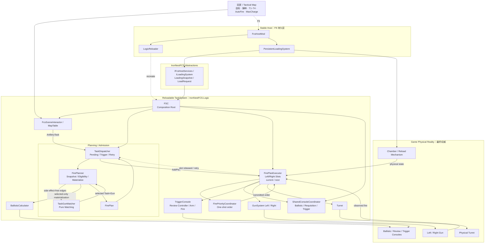

# IronNestFCS Smart — Project Context

> 状态快照：2026-08-13（UTC+8）  
> 当前正式版本：**v1.2.0**  
> 默认分支：`master`  
> 发布基线：`8197223ced619525d78d4b7bc24f7a30aacc28e7`（`release: v1.2.0`）  
> 本组文档由原单文件 `IronNestFCS-Smart_项目背景与设计来源.md` 拆分而来。

> 定位：长期稳定原则、项目身份、F9 语义、总体架构图、关键不变量与资料权威规则。

## 文档导航

- `PROJECT_CONTEXT.md` — 先读；长期原则与总体模型。
- `ARCHITECTURE_PLANNING.md` — Planning / Matching / Admission。
- `ARCHITECTURE_EXECUTION.md` — Execution / Review / Arm / Physical Settlement。
- `KNOWN_ISSUES_AND_ROADMAP.md` — 已知问题与后续优化。
- `PROJECT_HISTORY.md` — 历史决策与设计来源。
- `RELEASE_AND_OPERATIONS.md` — 构建、日志、发布与维护规则。

**权威顺序：当前仓库代码与实机证据 > `PROJECT_CONTEXT.md` > 当前架构文档 > Roadmap > History。**

---

## 项目身份

**项目名：** IronNestFCS Smart  
**仓库：** https://github.com/HisenWeb/IronNestFCS-Smart  
**Nexus Mods：** https://www.nexusmods.com/ironnest/mods/32  
**游戏：** Iron Nest: Heavy Turret Simulator  
**技术栈：** C# / MelonLoader / IL2CPP

IronNestFCS Smart 是从以下上游仓库继续开发的 fork：

- https://github.com/svr2kos2/IronNestFCS

需要注意：

- `svr2kos2/IronNestFCS` 是本项目直接 fork / 继续开发的**上游仓库**。
- 不应把 `svr2kos2` 表述为“IronNestFCS 的最初作者”，因为这一点并没有被当前资料可靠证明。
- 对外文档统一使用 **upstream / 上游** 的表述。
- 当前仓库仍保持 GitHub fork 关系。

公开定位可概括为：

> A reliability-focused automated fire-control mod for Iron Nest: Heavy Turret Simulator.

Smart 的重点不是“增加更多自动化按钮”，而是让连续任务、双炮、不同装填状态、F9 重规划和人工干预下的自动化仍然可靠。

---

## 核心设计理念

项目最重要的一句话：

> **自动化操作，不自动化战术。**  
> **Automate the work, not the tactics.**

玩家负责：

- 选择目标；
- 放置 T1～T4 目标标记；
- 选择弹药；
- 决定任务提交顺序；
- 决定是否启用 Auto Fire；
- 决定是否启用 Max Charge；
- 必要时按 F9 放弃当前计划并重新规划。

FCS 负责：

- 弹道解算；
- Task × Gun 匹配；
- 左右炮任务分配；
- 自动购买缺失弹药；
- 装弹 / 装药；
- 仰角调整；
- 炮塔旋转；
- Review 确认流程；
- Arm / 保险操作；
- 可选的自动击发；
- 双炮执行顺序；
- 物理击发结算；
- 炮位恢复后继续处理 Pending；
- 任务计划被推翻后，根据**真实物理状态**继续工作。

Smart 的目标不是让 AI 替玩家决定“打谁”，而是把重复机械操作自动化，并保证自动化系统面对复杂现场时仍然能收敛到真实状态。

因此，以下能力原则上不属于 Smart 核心方向：

- 自动发现敌人；
- 自动评估威胁；
- 自动给敌人排序；
- 自动选择战术目标；
- 自动把敌人塞入 T1～T4；
- 让系统替玩家决定战术优先级。

---

## Smart 与上游真正的分叉点

Smart 不是简单的“上游 + 更多功能”。

真正的分叉是：

> **重新定义任务计划、物理现实、调度、共享控制资源和 UI 之间的边界。**

最核心的抽象仍然可以压缩为：

```text
计划是计划
现实是现实
UI 是 UI
```

三者不应互相冒充。

### 容易出问题的旧式思路

```text
任务认为“现在应该装完了”
→ 就按内部记忆继续

地图上的炮位标记
→ 被当成真实炮位来源

F9 重载任务逻辑
→ 连已经发生的物理装填也一起“重置”

调度认为 current 应该开火
→ 就把 current 当成实际已击发的炮
```

### Smart 当前原则

```text
真实炮膛 / 装填机构 / 炮塔 / 控制器
→ 权威物理状态

任务 / FirePlan
→ 可以取消、失败、重建、重新分配

调度 current / next
→ 决定自动化执行顺序和共享方位角所有权

实际物理击发
→ 决定最终消费哪个 FirePlan

地图 UI
→ 表示玩家意图，不承担真实机械状态职责
```

---

## 当前系统的四个长期边界

未来重构时，优先保护以下四个边界。

### Host 与 Logic

```text
Host  = 持续存在的物理现实
Logic = 可以被 F9 推翻的任务计划
```

### Eligibility 与 Ranking

```text
Eligibility = 能不能配
Ranking      = 能配以后，哪个更合适
```

典型例子：

```text
“C2 能不能打 13km”
→ 硬资格条件

“9.7km 用 C2 比 C3 更节省射程能力”
→ 匹配权重
```

不能用软权重代替硬资格。

### 计划顺序与物理结果

```text
current / next
→ 自动化执行顺序

physical shot
→ 实际结果
```

调度不能伪造现实。

### Review 与击发授权

```text
Review confirmation
→ 后台物理按钮持续收敛

Arm / Fire authority
→ 单独由当前击发机会决定
```

Review Ready 不等于击发授权。

---

## F9 的最终语义

Smart 对 F9 的定义已经稳定：

> **F9 = 放弃当前任务计划并重新规划。**

而不是：

> “把整个火控系统和已经发生的现实状态全部重置”。

最关键的一句话：

> **F9 重置的是计划，不是已经发生的物理状态。**  
> **F9 resets the plan, not physical state that already exists.**

玩家按 F9 后：

```text
清空当前 TaskSystem 任务 / Pending
↓
清空 FirePlan / current / next / 调度状态
↓
TaskSystem Logic 被销毁并重建
↓
已经被 Host 接受的物理装填事务继续
↓
重新读取炮膛 / 装填 / 炮塔 / 控制台现实
↓
玩家重新提交 T1～T4
↓
新任务从当前真实状态重新规划
```

因此：

- 已经装进炮膛的弹不会因为 F9 消失；
- 已经开始的装弹 / 装药不会因为任务对象被销毁就被当成没发生；
- 新任务必须适应现实，而不是要求现实回滚到新任务的理想状态。

---

## 当前总体架构

当前 `FSC` 是 reloadable TaskSystem 的 **composition root**。

它主要负责组装模块，不应该重新演变成巨型业务类。

当前主结构：

```text
Stable Host
├─ FcsHostMod
├─ LogicReloader
└─ PersistentLoadingSystem
        │
        │ ILoadingSystem / IFcsHostServices
        ▼
Reloadable Logic
├─ FSC — Composition Root
├─ Planning / Admission
│  ├─ TaskDispatcher
│  ├─ FirePlanner
│  └─ TaskGunMatcher — stateless pure matcher
├─ FirePriorityCoordinator
├─ FirePlanExecutor
├─ SharedConsoleCoordinator
├─ FcsSceneInteractor
├─ MapTable
├─ BallisticCalculator
├─ PurchaseDeck
├─ GunSystem Left
├─ GunSystem Right
├─ Turret
└─ TriggerConsole
```

这里表示的是**模块关系**，不是对象所有权树。`TaskGunMatcher` 是无状态纯匹配模块，并不是 `FSC` 持有的长期实例。

核心执行链：

```text
玩家任务意图
→ TaskDispatcher
→ FirePlanner Eligibility
→ TaskGunMatcher
→ FirePlanner Materialize
→ FirePlan
→ FirePlanExecutor
→ FirePriorityCoordinator
→ current / next
→ Local + Shared execution
→ physical fire settlement
→ consume actual fired plan(s)
→ release slot
→ Pending redispatch
```

---

## 架构模型图



---

## 当前已知的正确维护方向

后续优先：

- 连续任务可靠性；
- 物理状态恢复；
- 双炮协调；
- Pending 唤醒；
- 人工干预后的重新收敛；
- 真实状态读取；
- shared resource 串行化；
- 用户可理解的 HUD；
- 小而明确的 upstream 共性 Bug fix；
- Dispatcher planning-round 的局部职责拆分；
- Matcher cost model 的进一步改进。

谨慎：

- 自动雷达；
- 自动目标选择；
- 自动威胁排序；
- AI 战术；
- 大规模“为了优雅而优雅”的重构；
- 没有实机证据的 mechanism 推断；
- 把 current / next 和 LocalReady 混为一谈；
- 绕过物理按钮锁；
- 在 assignment 前调用有副作用的游戏 API。

---

## 当前不应该破坏的关键不变量

### F9

```text
F9
≠ reset physical loading reality
```

### Matching

```text
先 Eligibility
再 Matching
再 Materialization
```

### Ballistic side effect

```text
未选中的 Task×Gun edge
不应调用物理 Ballistic Calculate
```

### Scheduling

```text
LocalReady
不重新定义 current / next
```

### Shared azimuth

```text
current
拥有 shared azimuth execution
```

### Safety

```text
current 只解除自己的保险
follower 由自己的流程解除自己的保险
```

### Physical authority

```text
observed physical shot
决定实际消费哪个 FirePlan
```

### Recovery

```text
FirePlan 在 shot 结束
post-shot recovery 属于 physical/loading runtime
```

### Review

```text
Review convergence
≠ firing authority
```

### Dispatcher retry

```text
free transient gun side
本身就是 future dispatch opportunity
```

---

## 当前最重要的一句话结论

如果只保留项目最核心的记忆，应记住：

> **自动化操作，不自动化战术。**

> **F9 重置的是计划，不是物理现实。**

> **装填属于持续存在的 Host 物理系统，任务属于可重规划的 Logic。**

> **先 Eligibility，后 Matching，最后才 Materialize 有副作用的游戏操作。**

> **TaskGunCandidate 是资格边，FirePlanCandidate 是已 materialize 候选，FirePlan 是已提交执行计划。**

> **current / next 决定自动化顺序和共享方位角，不由 LocalReady 重排。**

> **当前炮只解除自己的保险；另一门符合击发机会时，由自己的流程解除自己的保险。**

> **实际观察到的物理击发决定最终消费哪个 FirePlan。**

> **FirePlan 在 shot 结束；PostShotRecovery 属于 physical/loading runtime。**

> **Recovering 的空闲炮位本身就是未来 Dispatch Opportunity。**

> **真实炮位来自 TurretLocation，地图 UI 不应成为物理权威源。**

> **Smart 与 upstream 已经发生架构分叉；upstream PR 应优先做最小共性修复。**

---

## 本资料的定位

本文件不是 changelog，也不是 README 的替代品。

它主要回答：

> **IronNestFCS Smart 为什么会变成现在这样？当前架构的边界是什么？哪些决定已经做过，不应该在未来会话里反复推翻？**

未来如果重新讨论：

- 要不要拆模块；
- Dispatcher 是否过于复杂；
- F9 应该怎么处理；
- Loading 和 Task 是否应该耦合；
- Eligibility / Matcher / Materialization 应该怎么分；
- current / next 是否应该被 LocalReady 改写；
- Review 是否应该阻塞 Arm；
- same-azimuth 另一门炮该如何解除保险；
- 物理击发和 FirePlan completion 谁更权威；
- UI 是否可以当物理状态；
- 是否应该做自动雷达 / 自动选目标；
- 为什么 Smart 不适合直接向 upstream 提交整套架构；

优先参考本文件中的设计背景和已确认边界。

如果未来新的实机证据推翻某个结论，应**明确更新本背景资料**，而不是让历史上下文和当前代码静默冲突。
